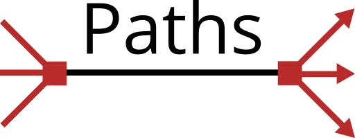

# Project Logo

## Details

- Software used: [Inkscape](https://inkscape.org)
- Font used: [Open Sans](https://www.google.com/fonts/specimen/Open+Sans)

## License

 js-task-path logo by <a xmlns:cc="http://creativecommons.org/ns#" href="https://github.com/jsstd/js-task-paths" property="cc:attributionName" rel="cc:attributionURL">Richard King</a> is licensed under a <a rel="license" href="http://creativecommons.org/licenses/by-sa/4.0/">Creative Commons Attribution-ShareAlike 4.0 International License</a>.